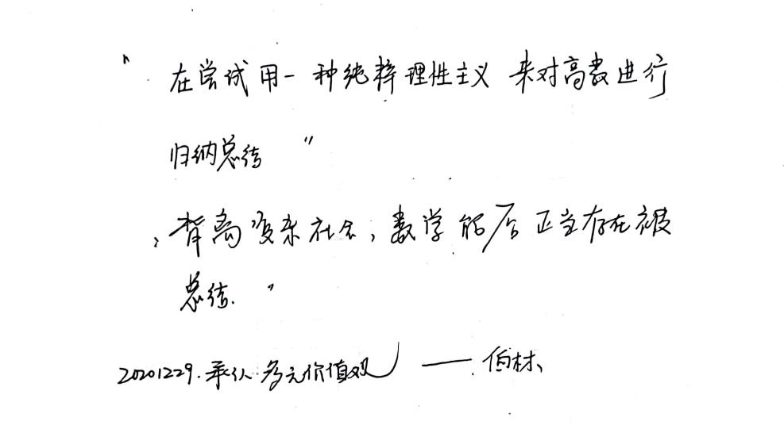
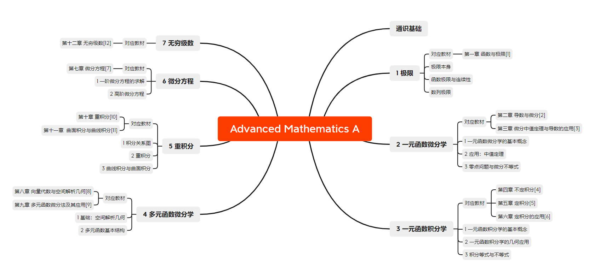
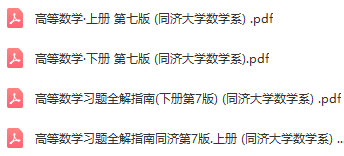

高数，很重要。后续很多课程都会用到这里面的知识，工科是建立在数理基础上的，这几乎成为了共识。

# 小序

今天是2022年9月8日，因为一些课程缘故，回来复习一下高数。看到了如下文字。

如今想来，真觉数学之深奥，愧不能及。路漫漫，求索之难矣。

# 知识结构与Notebook

两学期的高数放在了一起。所有参考内容来自老师教材，张宇考研资料以及其他边角料。知识结构为后来整理，Notebook为之前学习的一个存档，供自己使用，如有需要，可以参考。但内容细节有些地方会缺少，见谅。

# 教材与参考

链接：https://pan.baidu.com/s/1iY1QfHYYV-zzrfUBIisf3Q?pwd=eroz 
提取码：eroz 

