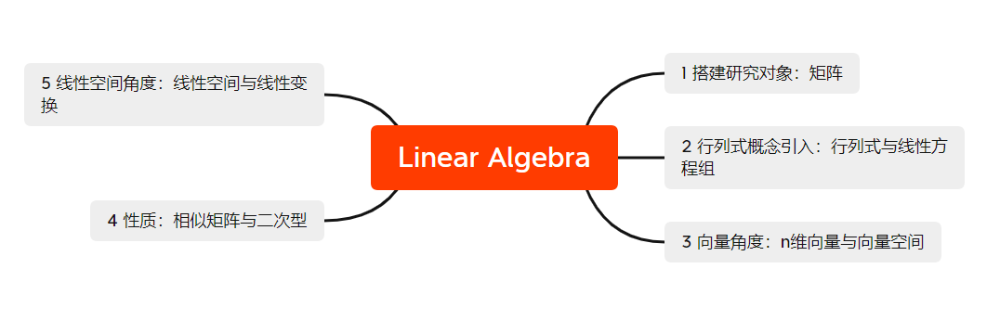

线性代数挺重要，也挺奇妙。比较抽象，努力学，理解题目，最后不会太差。

# 线性代数的地位

百度百科

> 线性代数是数学的一个分支，它的研究对象是[向量](https://baike.baidu.com/item/向量/1396519?fromModule=lemma_inlink)，[向量空间](https://baike.baidu.com/item/向量空间/5936597?fromModule=lemma_inlink)（或称线性空间），[线性变换](https://baike.baidu.com/item/线性变换/5904192?fromModule=lemma_inlink)和有限维的[线性方程组](https://baike.baidu.com/item/线性方程组/5904308?fromModule=lemma_inlink)。向量空间是[现代数学](https://baike.baidu.com/item/现代数学/3704792?fromModule=lemma_inlink)的一个重要课题；因而，线性代数被广泛地应用于[抽象代数](https://baike.baidu.com/item/抽象代数/1537111?fromModule=lemma_inlink)和[泛函分析](https://baike.baidu.com/item/泛函分析/4151?fromModule=lemma_inlink)中；通过解析几何，线性代数得以被具体表示。线性代数的理论已被泛化为算子理论。由于科学研究中的非[线性模型](https://baike.baidu.com/item/线性模型/9857200?fromModule=lemma_inlink)通常可以被近似为[线性模型](https://baike.baidu.com/item/线性模型?fromModule=lemma_inlink)，使得线性代数被广泛地应用于自然科学和社会科学中。

wiki

> **线性代数**（英语：linear algebra）是关于[向量空间](https://zh.wikipedia.org/wiki/向量空间)和[线性映射](https://zh.wikipedia.org/wiki/线性映射)的一个[数学](https://zh.wikipedia.org/wiki/数学)分支。它包括对线、面和子空间的研究，同时也涉及到所有的向量空间的一般性质。
>
> 坐标满足线性方程的点集形成[*n*维空间](https://zh.wikipedia.org/wiki/歐幾里得空間)中的一个[超平面](https://zh.wikipedia.org/wiki/超平面)。*n*个超平面相交于一点的条件是线性代数研究的一个重要焦点。此项研究源于包含多个未知数的[线性方程组](https://zh.wikipedia.org/wiki/线性方程组)。这样的方程组可以很自然地表示为[矩阵](https://zh.wikipedia.org/wiki/矩阵)和[向量](https://zh.wikipedia.org/wiki/向量)的形式。
>
> 线性代数既是纯数学也是应用数学的核心。例如，放宽向量空间的公理就产生[抽象代数](https://zh.wikipedia.org/wiki/抽象代数)，也就出现若干推广。[泛函分析](https://zh.wikipedia.org/wiki/泛函分析)研究无穷维情形的向量空间理论。线性代数与微积分结合，使得[微分方程](https://zh.wikipedia.org/wiki/微分方程)线性系统的求解更加便利。线性代数的理论已被泛化为[算子理论](https://zh.wikipedia.org/w/index.php?title=算子理论&action=edit&redlink=1)。
>
> 线性代数的方法还用在[解析几何](https://zh.wikipedia.org/wiki/解析几何)、[工程](https://zh.wikipedia.org/wiki/工程学)、[物理](https://zh.wikipedia.org/wiki/物理)、[自然科学](https://zh.wikipedia.org/wiki/自然科学)、[计算机科学](https://zh.wikipedia.org/wiki/計算機科學)、[计算机动画](https://zh.wikipedia.org/wiki/计算机动画)和[社会科学](https://zh.wikipedia.org/wiki/社会科学)（尤其是[经济学](https://zh.wikipedia.org/wiki/经济学)）中。由于线性代数是一套完善的理论，非线性[数学模型](https://zh.wikipedia.org/wiki/数学模型)通常可以被[近似](https://zh.wikipedia.org/wiki/近似)为[一般线性模型](https://zh.wikipedia.org/wiki/一般線性模型)。

……

# 参考

我深知数学本身内容复杂，无论如何探索，再次接触仍有新的体会。只记得当时学习过程中，**线性代数前后关联度、映射程度极大**。我放了一个杨威老师的知识导图，用以参考对应。

放一些当时的学习途径。

1. 【主要】杨威老师 b站视频 **线帒杨**， 主要看了习题册的讲解，从题目中理解线性代数。
1. 放了笔记和做题笔记，主要给自己看，不具有参考价值。
1. 放了老版教材，包括理工类、经管类线性代数及应用，线性代数疑难释义。

