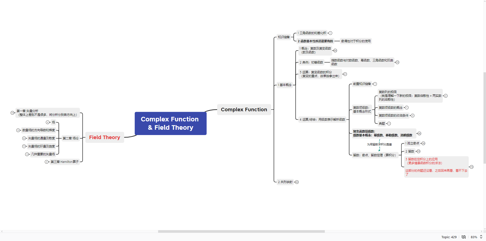

复变函数与场论，主要还是讲复变函数，就是复数的函数，之前接触的实变函数。反正有难度，好好理解，题目认真做。也是之后数学物理方法、电磁场与天线等等的前置数学基础课。

# 1 知识结构

相对比较简略，建议把ppt多看几遍，尤其是例题。

# 2 教材

总体感觉，这门课学的还是较少，考的较深。

1. 书本的电子版主要用来布置作业，西交那版。
2. 推荐一本 《复变函数方法论》这本书大致能看到复变的一些基础知识逻辑和结构。可以感觉到工科本科真的触及不到数学秃头的“乐趣"，我们学的复变也只是其中的一小部分，对函数本身理解。和学数学的同学交流过，感觉数学真的好难，曾经幻想学点数学，后来发现没有时间，也没有天赋（逃）。

# 3 答案

西电复变函数配套答案。但答案并不全，共形映射没有，网上可找到。

> 另建议有数学追求的同学，可以看看thu&pku，或者国外的哈佛麻省等数学的培养方案。数学这个东西，前期感觉大多还是靠熬。
