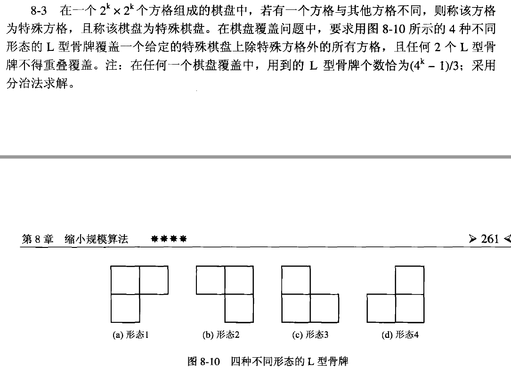
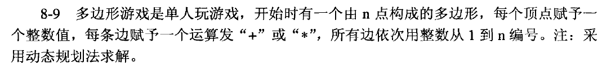

这里是个题目说明，这些代码仅做参考，杜绝抄袭！（如果代码跑不通，可能环境不匹配等各种问题，请改好联系我，嘻嘻。）

环境是 visual studio 2019 （比较文件笨重，故放网盘了）或者 dev c++ 

链接：https://pan.baidu.com/s/1PTly-DElf46Bc2wekWnY8A?pwd=uq75 
提取码：uq75 

# 2.linear list / 线性表

1. 实现积分（似乎没用线性表）
2. 实现多项式相加
3. 学生信息管理系统（程序中读取文件需要修改路径）

# 3.stack and queue / 栈和队列

1. 斐波那契数列

这部分好像有其他题目，我找不到了。不过栈和队列，基础理解不是太难。

# 4.string and array / 字符串和数组

1. KMP匹配

# 5.tree / 树

1. 线索化二叉树（这个当时没跑通，放一个朋友的）
2. 哈夫曼构造（代码找不到了）

# 6.map / 图

当时好像让写遍历程序，没时间了好像，我写的太乱，就删掉了。acwing里那个写了，之后考虑放。

# 8.缩小规模算法（教材是这么说的）

1. 棋盘覆盖（递归）

   好像是这个题（当时就写了这个题，不理解为什么只做这个题，很匆忙，不理解哇）。

   简单来看，是棋盘覆盖问题。主要用递归思想，分治策略。

   

2. 多边形问题（线性规划）

总体看，老师期望很高，落地较少，以及不合理的课时和作业（课少量多跨度较大，难掌握）。理解老师期待，望提供一些参考，后生节节高。

