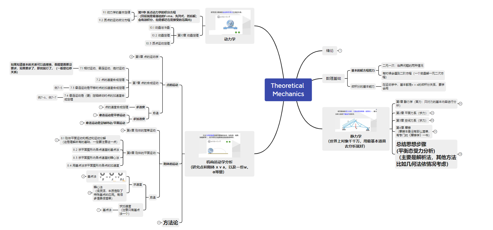

理论力学，大名鼎鼎四大力学之一。网上传闻物理学专业的同学要学四大力学，分别为理论力学、电动力学、热力学与统计物理以及相对论与量子力学。除了电动力学不专门学，其他都学。

> 实际上，电动力学主要涉及电磁基本现象、静电场、静磁场、电磁波、以及与相对论结合的部分。其实大部分对于EECS的同学来说，基本上也差不多了解了，就算有遗漏，几个小时也能补回来。故约等于四大力学都学乐（秃）。

理论力学是高中静力学、运动学和动力学的高阶版。其引入了复杂系统的受力分析、矢矩分析，同时也要对复杂系统做运动分析，最难的是刚体的平面运动等等。动力学部分没有完全学完。

主要还是多做题。

# 1 知识结构

不多说了，就是一个体系。主要还是多做题。高中过来的应该知道，像物理和数学，这种知识点抽象的科目，不去应用相当于不会。

# 2 教材

配套教材。课后题能理解，且记住就很好了。

# 3 ppt

上课ppt，供参考