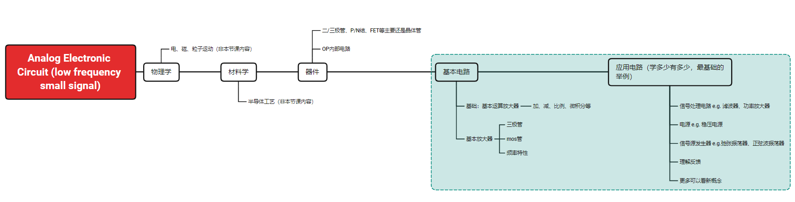

这里是一些学习模电的资料。模电是整个电子信息系统的基础入门课之一，多理解原理，电路模拟等等会比较好。在新概念模拟电路中作者也提到了学好的方法。一般来说，还是建议紧跟老师的作业和课程，结果不会太差。

# 1 [新概念模拟电路](新概念modian.zip)

无论是学习还是电赛，都是非常好的学习读物。不多解释。

# 2 [模拟课件](模电仿真课件(西电专用)/)

这是xdu老师的课件，基于multisim进行仿真，有助于理解不同的电路。有条件有时间可以在实验室搭电路玩玩。

# 3 [知识结构](Analog%20Electronic%20Circuit%20(low%20frequency%20small%20signal).xmind)

老师讲的时候用的是笔书，所以没有ppt。我做了知识结构，但是文件损坏了，所以没有放。不过参考新概念模拟电路的结构就挺好的。

我简单说一下结构。

前面就直接讲上层的应用运算放大器的部分，对于应用来说这些就够了。

不过，如果深入专业些，就需要学习二极管、三极管、mos管等等底层硬件，及其构成的放大器。这些放大器有运放达不到的效果，所以对于综合电路还是很有用的。

最后就是综合了，理解什么是反馈，系统如何稳定，具体几个应用的模拟电路，比如稳恒电源、功率放大器等等。老师说，这里模电才刚刚开始，然而到这里就结束了。更多的东西理应开高级模拟电路课程，但是本科到这里就结束了。换言之，更多其实要自学。

原版导图没了，放个新的。另，打电赛的同学，看绿色框部分基本就可以开始下手实操了，更多在实践中学（比如电路频率怎么提高等等）。

# 4 [Notebook](Notebook.pdf)

我上传的是个人笔记，每年教学内容会有一些出入，但大体上不会变化太多。老师的笔记未上传。
