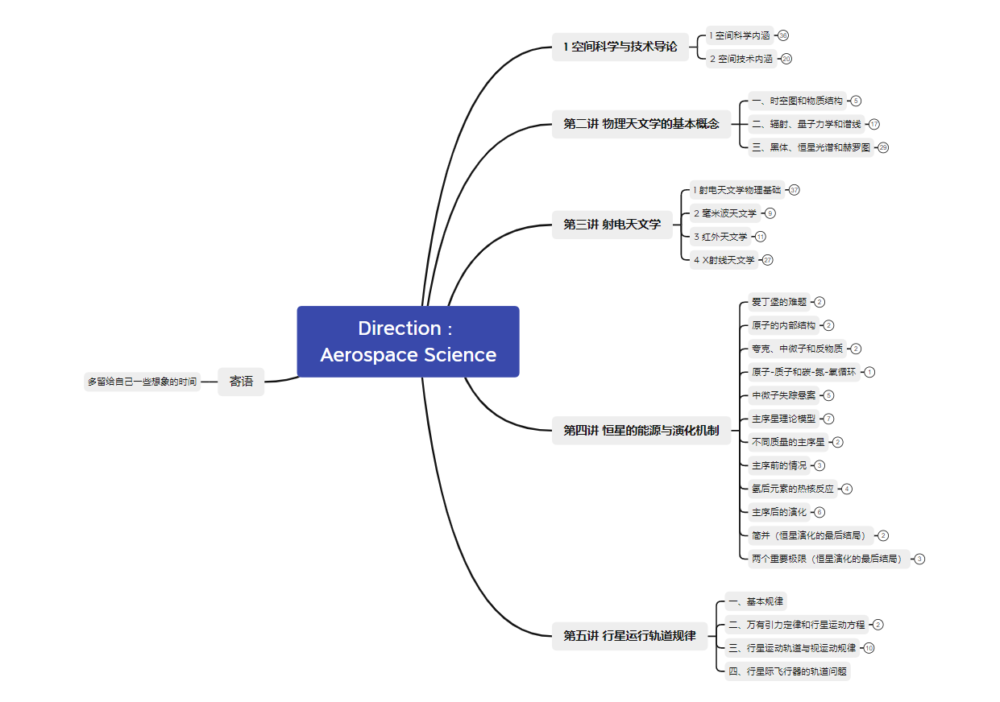

这门课比较深奥，完全学懂挺难，有了一个概念。相关关于空间科学的书籍还有很多，比如吴季的《空间科学概论》等等，都可以作为拓展，本课程对于了解空间科学远远不足。北斗杯等一系列比赛也推出了一个 “北斗智能”的时代，也是一个十分交叉的方面，当然空间科学技术领域本身就很交叉。这门课还是有点感受的，就是空间这个领域未来前景很大，甚至很难看到边界，比如SKA的超大数据时代、韦伯的极远探测范围等等都有着无法预料的前景。

除了知识结构，我还放了一个当时的[报告](/XUD_Report_空间科学导论.pdf)，是最后的作业，仅做参考。

# 知识结构

上课听了一部分，内容不是很全，但是有个大概。

链接：https://pan.baidu.com/s/1l_LYEmaps68lIgHmjQHM8g?pwd=0qda 
提取码：0qda 
