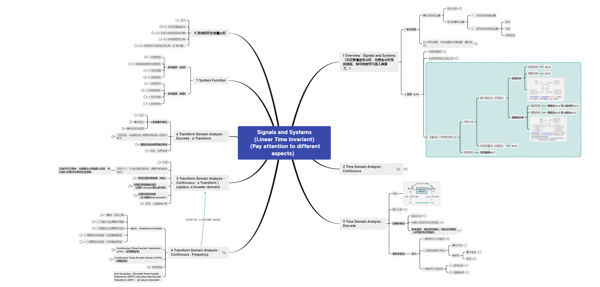

信号与系统，这门课是理解信号最重要的一门课，是之后很多课的基础。主要去理解除了时域之外其他域的信号，比如频域、z域、s域。其实都是一个变换，换一个角度去理解信号，理解世界。空说无用，还是要投入学习一下。以下是帮助资料。

# 1 知识框架

本结构是基于老师的ppt演化而来，方便复习、回忆以及帮助速学。

# 2 教材

一个是西电用的教材，很多编者就是西电老师。

一个是国外的奥本海姆教材，大概看了看，也挺好，知识结构差不太多。不过确实享誉盛名。

链接：https://pan.baidu.com/s/1ROF7bPkrl1ktBGwPkMjFZQ?pwd=1qan 
提取码：1qan 

