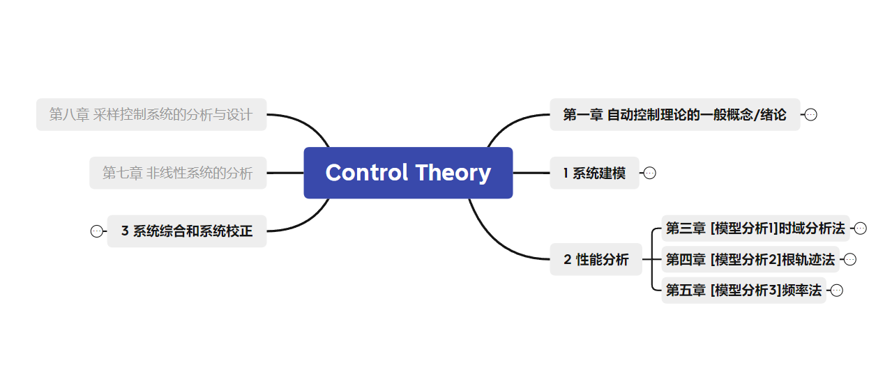

## 自动控制原理

从其实际意义上看（工程角度），下文引用自刘丁教材

> 二、自动控制的主要任务
>
> 在现代工程科学技术发展过程中，自动控制无论是作为一项先进的技术还是作为有效的方法，都在各个领域扮演着越来越重要的角色。**自动控制的主要任务就是在没有人直接参与的情况下，应用某种设备或装置（称为控制器）自动地、有目的地操纵生产机械或生产过程（称为被控对象），使其工作状态或参数（即被控量）按预期的规律运行。**将自动控制技术应用于生产实际，能够有效地提高产品质量，降低生产成本和劳动强度。
>
> 自动控制理论和技术的不断发展，不仅使飞船登月、人类邀游太空成为现实，而且也已成为现代制造业和工业生产过程中重要且不可缺少的组成部分。例如，在制造业中，数控机床能够高精度、高效率地完成复杂形状的加工任务；在化工生产过程中，化学反应炉的温度或流量自动地根据生产工艺的要求而变化与调整；在电力生产中，发电设备可以自动地协调多个变量的变化，满足电网负荷的要求：在军事上，导弹发射和制导系统自动地将导弹精确引导至敌方目标等。近几十年来，随着计算机技术的迅猛发展，使自动控制不仅在工程技术领域得到了日益广泛的应用，而且在生物、化学、环境、经济管理和社会科学等领域日益发挥着重要的作用。

从数学上看，这门课是新学一些数学工具，来处理系统的数学模型。性能分析部分是重点，主要为时域分析法、根轨迹法、频率法。

> 控制理论的两大基本任务：
>
> 1.系统分析：系统建模，性能分析（稳快准）；
> 2.系统设计：系统综合，系统校正。
>
> 系统综合：设计一个控制系统，使其运动具有给定的性能和特征。
> 系统校正：一般而言，由基本部分组成的系统往往达不到给定的性能指标，甚至是不稳定的，此时需要在系统中接入附加装置，改善系统性能，并反复调整，直至满足要求。附加装置称为校正装置；引入附加装置、改善性能的过程称为系统校正。校正的实质均表现为修改描述系统运动规律的数学模型。设计校正装置的过程是一个多次试探的过程并带有许多经验，计算机辅助设计（CAD)为系统校正装置的设计提供了有效手段。

资料：

通过网盘分享的文件：Priciple of Automatic Control
链接: https://pan.baidu.com/s/1fHhWtP7y44TN-i1e2mLgxQ?pwd=sxj9 提取码: sxj9 