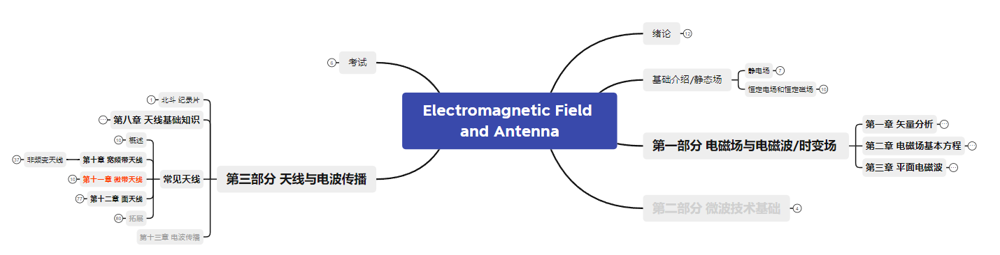

### 电磁场、微波与天线

电磁场与天线是本次授课的主要内容。参考教材是《电磁场、微波技术与天线（第二版）》，教材内容是大于ppt的，因此知识结构图包括了所有的ppt内容以及一些拓展内容。拓展内容主要涉及教材和自己学习中的感悟。这门课除了理解，主要记忆结论。

微波部分，上传的教材中会有涉及及参考。

其他资料：
链接: https://pan.baidu.com/s/1kVbU-pw-3y3oMtPAgndNgA?pwd=9h4c 提取码: 9h4c 
--来自百度网盘超级会员v6的分享