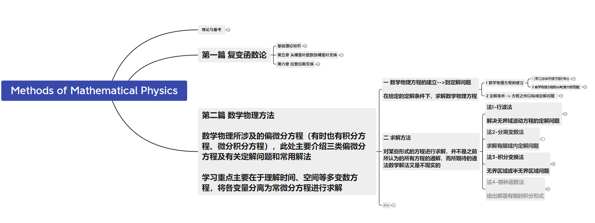

## 数学物理方法

以下引用《数学物理方法 (顾樵)》书中内容，基本介绍了数学物理方程研究的内容：

> 追溯历史，数学的发展有两条清晰的轨迹：一是纯理论性发展；二是与物理等实体科学和工程问题相结合。**数学物理方法明显属于后者，作为一门高等数理工**
> **具，日益突显其广泛的实用性。它不仅可以直接用于物理学，而且涉及几乎所有理工类学科，甚至包含生命科学和经济学。**
>
> 正如第1章所讨论的，许多实际问题可以用常微分方程模型描述，只涉及一个变量。但是有更多的问题一般含有两个变量，如空间与时间。而数学物理方法所研究的主要对象是包含两个（或更多）变量的偏微分方程问题。数学物理方程的典型例子是电磁场的麦克斯韦方程和量子力学的薛定谔方程，前者涉及电磁场的时空变化规律，后者则包含波函数的时空依赖特征。而基本的数学物理方程有三类：①基于弦振动问题的波动方程：②热传导方程；③描述多维系统稳态温度分布及电磁场空间分布的拉普拉斯方程。

而在本次学习中，重点讨论了分离变数法，其他详细的比如格林函数法，薛定谔方程等因课时原因并没有进一步讨论。下面的xmind对于理解数学物理方程有着较好的帮助。

其他资料：

通过网盘分享的文件：Mathematical Physics Method
链接: https://pan.baidu.com/s/1FZUco-07W7BdKijBQJ4ukg?pwd=arpi 提取码: arpi 