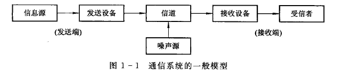
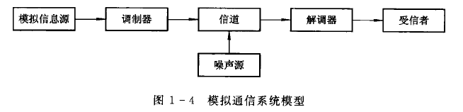
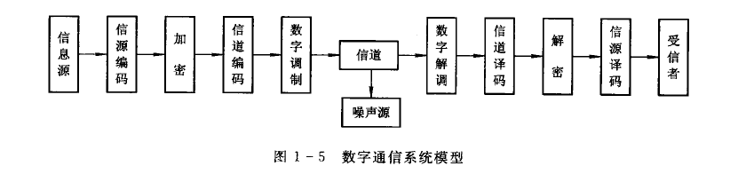

## 通信原理

其他资料：链接: https://pan.baidu.com/s/1MqPqqq-Y4jfs-2A6fH5Fdw?pwd=bvwe 提取码: bvwe 

## Review

> 因为这门课学艺不精，这里对通信原理知识图谱做简要的回顾和复习。**详细的模型、推导和结论还是要自己去理解。**

### 数学基础：随机过程

这个世界有太多的不确定性，以随机过程为代表的统计学正在成为各行各业流行发展的内容。

> 信息与不确定性有关。如果一个待接收的信号事先已经确知，它就不可能载有任何信息。因此载有信息的信号必须是不可预测的，或者说带有某种随机性。干扰信息信号的噪声更是不可预测的。这些**不可预测的信号和噪声都是随机过程的例子**。但是随机信号和噪声的不可预测性的意义完全不同，随机信号的不可预测性是它携带信息的能力，而噪声的不可预测性则是有害的，它将干扰有用信号的正确接收。
>
> 在通信系统中，随机过程是重要的数学工具。在建立信源的统计模型、描述信道和噪声的统计特性以及分析通信系统抗噪声性能等方面都将用到它。

### 两大类通信系统

#### General System

通信系统的作用就是将信息从信源传送到一个或多个目的地。实现信息传递所需的一切技术设备（包括信道）的总和称为通信系统。通信系统的一般模型如图1一1所示。

图中各部分的功能简述如下：

**信息源**（简称信源）是消息的发源地，其作用是把各种消息转换成原始电信号（称为消息信号或基带信号)。根据消息种类的不同，信源可分为模拟信源和数字信源。
	模拟信源送出的是模拟信号，如麦克风（声音→音频信号）、摄像机（图像→视频信号）；
	数字信源输出离散的数字信号，如电传机（键盘字符→数字信号）、计算机等各种数字终端。并且，模拟信源送出的信号经数字化处理后也可送出数字信号。

**发送设备**的功能是将信源和信道匹配起来，即将信源产生的消息信号变换成适合在信道中传输的信号。因此，发送设备涵盖的内容很多，可以是不同的电路和变换器，如放大、滤波、编码等。在需要频谱搬移的场合，调制是最常见的变换方式。

**信道**是指传输信号的物理媒质。在无线信道中，信道可以是大气（自由空间）；在有线信道中，信道可以是明线、电缆、光纤。有线和无线信道均有多种物理媒质。信道在给信号提供通路的同时，也会对信号产生各种干扰和噪声。信道的固有特性及引入的干扰与噪声直接关系到通信的质量。

**噪声源**不是人为加人的设备，而是信道中的噪声以及通信系统其他各处噪声的集中表示。噪声通常是随机的，其形式是多种多样的，它的存在干扰了正常信号的传输。关于信道与噪声的内容将在第3章中讨论。

**接收设备**的功能是放大和反变换（如滤波、译码、解调等），其目的是从受到干扰和减损的接收信号中正确恢复出原始电信号。

**受信者（信宿）**是传送消息的目的地。其功能与信源相反，即将复原的原始电信号还原成相应的消息，如扬声器等。

图1-1概括地描述了一个通信系统的组成，它反映了通信系统的共性，因此称之为通信系统的一般模型。根据研究的对象以及所关注的问题不同，图1-1模型中的各小方框的内容和作用将有所不同，因而相应有不同形式的更具体的通信模型。

通信原理主要是两个大类——模拟通信系统和数字通信系统。

#### Analog Communication System

模拟通信系统是利用模拟信号来传递信息的通信系统，如图1-4所示。我们知道，信源发出的原始电信号是基带信号，基带的含义是指信号的频谱从零频附近开始，如语音信号为300~3400Hz,图像信号为0~6MHz。由于这种信号具有频率很低的频谱分量，一般不宜直接传输，这就需要把基带信号变换成适合在信道中传输的信号，并在接收端进行反变换。完成这种变换和反变换的通常是调制器和解调器。经过调制以后的信号称为已调信号。已调信号有三个基本特征：一是携带有信息，二是适合在信道中传输，三是信号的频谱通常具有带通形式，因而已调信号又称带通信号或频带信号。

需要指出，消息从发送端到接收端的传递过程中，不仅仅只有连续消息与基带信号、基带信号与频带信号之间的两种变换，**实际通信系统中可能还有滤波、放大、天线辐射、控制等过程。由于以上两种变换对信号的变化起决定性作用，而其他过程对信号不会发生质的变化**，因此，本书中关于模拟通信系统的研究重点是：调制与解调原理以及噪声对信号传输的影响（详见第4章）。

#### Digital Communication System

数字通信系统是利用数字信号来传递信息的通信系统，如图1-5所示。数字通信涉及的技术问题很多，其中主要有信源编码与译码、信道编码与译码、数字调制与解调、同步以及加密等。

1. 信源编码与译码

   信源编码的作用之一是提高信息传输的有效性，即通过某种数据压缩技术来**减少信息的冗余度**（减少信息码元数目）和降低数字信号的码元速率。因为码元速率将决定传输带宽，而传输带宽反映了通信的有效性。
   作用之二是完成**模/数(A/D)转换**，即把来自模拟信源的模拟信号转换成数字信号，以实现模拟信号的数字化传输（详见第6章）。信源译码是信源编码的逆过程

2. 信道编码与译码

   数字信号在信道传输时，由于噪声、衰落以及人为干扰等，将会引起差错。为了减小差错，信道编码器对传输的信息码元按一定的规则加入保护成分（监督元），组成所谓“**抗干扰编码**”。接收端的信道译码器按一定规则进行解码，从解码过程中发现错误或纠正错误，从而提高通信系统抗干扰能力，实现可靠通信。

3. 加密与解密

   在**需要实现保密通信的场合**，为了保证所传信息的安全，人为将被传输的数字序列扰乱，即加上密码，这种处理过程叫加密。在接收端利用与发送端相同的密码复制品对收到的数字序列进行解密，恢复原来信息。

4. **数字调制与解调**
   数字调制就是把数字基带信号的频谱搬移到**高频**处，形成适合在信道中传输的频带信号。基本的数字调制方式有振幅键控ASK、频移键控FSK、绝对相移键控PSK、相对（差分)相移键控DPSK。对这些信号可以采用相干解调或非相干解调还原为数字基带信号。对高斯噪声下的信号检测，一般用相关器接收机或匹配滤波器。数字调制是本教材的重点内容之一，将分别在第7章和第9章中讨论。

5. 同步
   同步是保证数字通信系统有序、准确、可靠工作的前提条件。按照同步的功用不同，可分为载波同步、位同步、群同步和网同步，这些问题将集中在第11章中讨论。

   需要说明的是，图1-5是数字通信系统的一般化模型，实际的数字通信系统不一定包括图1~5中的所有环节，如在某些有线信道中，数字基带信号无需调制就可以直接传送，称之为数字信号的基带传输，其模型中就不包括调制与解调环节，详见第5章。

   应该指出的是，模拟信号经过数字编码后可以在数字通信系统中传输，数字电话系统就是以数字方式传输模拟话音信号的例子。当然，数字信号也可以在模拟通信系统中传输，如计算机数据可以通过传统的电话网来传输，但这时必须使用调制解调器(Modem)，以适应模拟信道的传输特性。

目前，无论是模拟通信还是数字通信，在不同的通信业务中都得到了广泛的应用。但是，**数字通信的发展速度已明显超过模拟通信，成为当代通信技术的主流**。但是，数字通信的许多优点都是用比模拟通信**占据更宽的系统频带**为代价而换取的。以电话为例，路模拟电话通常只占据4kHz带宽，但一路接近同样话音质量的数字电话可能要占据20~60kHz的带宽，因此数字通信的频带利用率不高。另外，由于数字通信对同步要求高，因而系统设备比较复杂。不过，随着新的宽带传输信道（如光导纤维）的采用窄带调制技术和超大规模集成电路的发展，**数字通信的这些缺点已经弱化**。随着微电子技术和计算机技术的迅猛发展和一泛应用，数字通信在今后的通信方式中必将逐步取代模拟通信而占主导地位。

