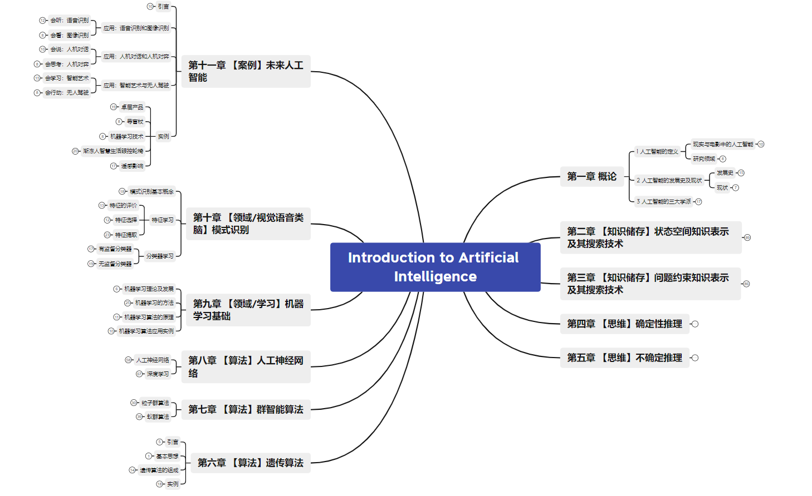

为了对人工智能有一定的了解，且后续课程有相应安排，故做本知识结构。本课程主要涉及人工智能的基本思想（如何储存知识和思维推理），以及一些常见的算法。仅做参考。

本结构来自西电MOOC人工智能导论

https://www.icourse163.org/learn/XDU-1207042802?tid=1467148753#/learn/announce

链接：https://pan.baidu.com/s/13zMhsucJW6TLLeEWqdAUhQ?pwd=4aa3 
提取码：4aa3 