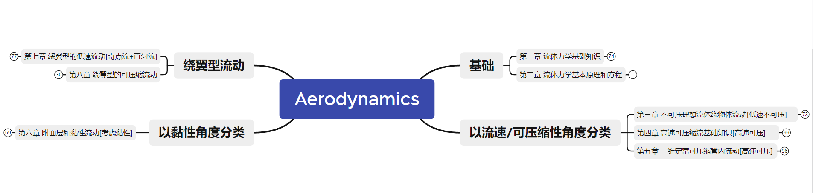

## 空气动力学基础

这门课确实难。这里只是对这门课程的知识逻辑做一个回顾。

> 根据我的考试回忆，仅仅把课程的逻辑弄明白是不够的，课堂上的一些常见的结论和例子也要记忆。这对于课堂的有效理解和教材的把握提出了较高的要求。当时自己状态欠佳，故学艺不精。今后有机会向各专业人士讨教。

### 知识图谱

对于空气动力学，我专门做了相应的视频来回顾这门课。包括其他资料：

链接: https://pan.baidu.com/s/1-W2NpQYtX2YPDooRBuclnQ?pwd=fddd 提取码: fddd 