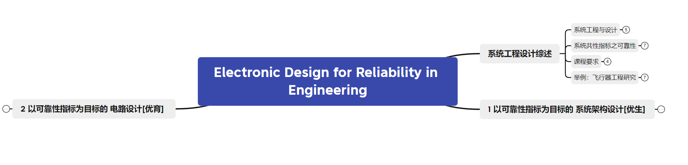
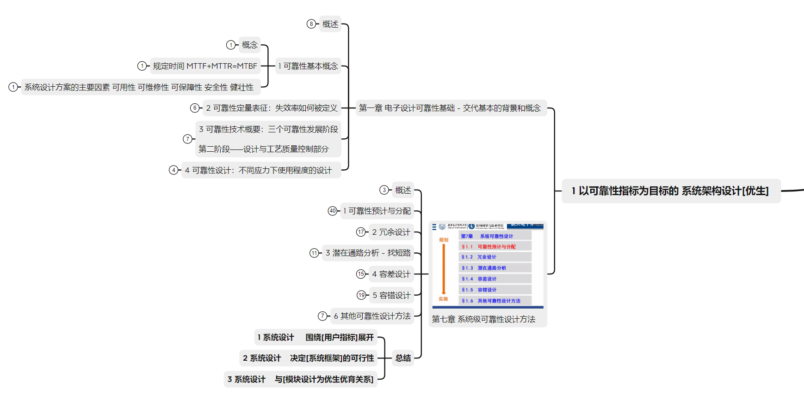
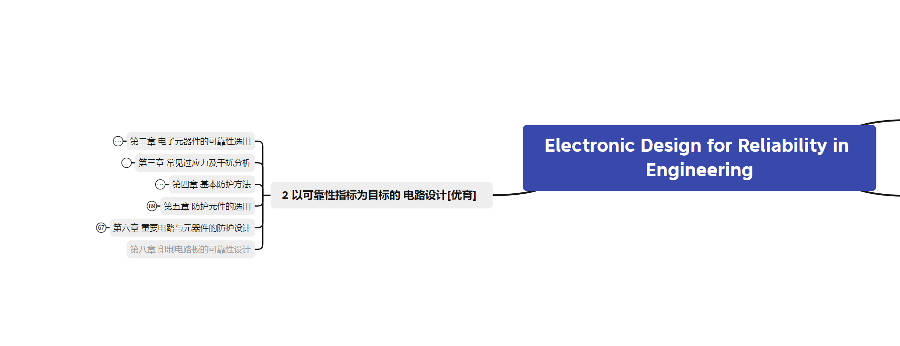

## 电子可靠性设计

首先，向庄奕琪教授致谢，有幸上过他的指导课程。

> 本书重点介绍在工程实践中所需要的、面向质量与可靠性保证和提升的电子产品设计方法。全书分为电子元器件可靠性应用和电路的可靠性设计两大部分，前者包括常规元器件的可靠性选择与应用以及可靠性防护元件的选用，后者包括电路级、系统级和印制电路板的可靠性设计。本书理论联系实际，图文井茂，技术覆盖面广，工程实践性强。

简单来说，这门课是工程性极强的课程。所以，前期了解只能大致理解理论。真正上手还是要在工程工作中去逐步体现。

### 知识体系

分别内容：

教材：链接: https://pan.baidu.com/s/1rzI-Q1DTyksO_NMtlohQ1w?pwd=a9ap 提取码: a9ap 

