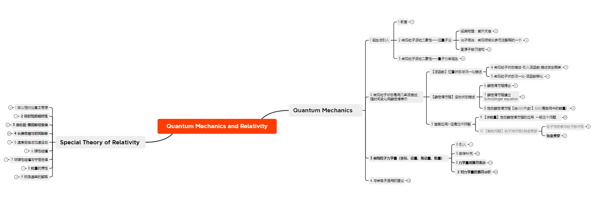

## 量子力学与相对论

实际教学过程中，大部分都是学习量子力学，由于老师是微电子学院的（宋老师人非常nice），所以后期偏向微电子材料的内容应用会提到一些。

> 作为四大力学学习的最后一站，量子力学也确实难度不小，终于体会到智商不够用，大多数都是在记结论。主要我当时状态很差，也没有逐步推导公式，所以也是学艺不精，只是粗略地了解了大概，供复习。

### 推荐b站视频

[【兰兰的不自量力】量子力学考研教学视频01：学习经验分享、波函数与薛定谔方程、归一化](https://www.bilibili.com/video/BV1uV41167vv/?share_source=copy_web&vd_source=859cb5682d8f7dad73bf16d74caf40d1)

这个讲的可以。

> 课堂上是没有多的题目供练习的，可以找一些考研题目来练习（有答案参考），实际中使用定态薛定谔。

资料：链接: https://pan.baidu.com/s/1qyTR5YNDqGhmbJFeUmXXkQ?pwd=8tvs 提取码: 8tvs 

### 最后

量子力学博大精深，深入学习还需更多学习路径。

