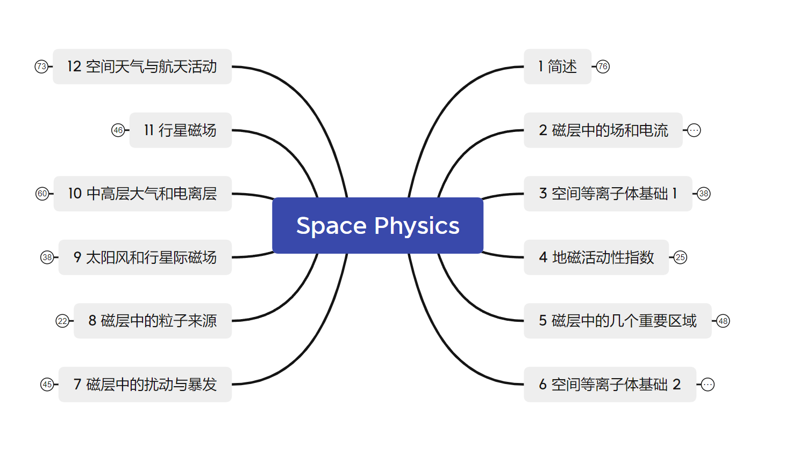

## 空间物理学

我毫无保留地致敬探索宇宙空间的所有科学家。

> 空间物理学是一门**新兴的多学科交叉**的前沿**基础学科**，它主要研究发生在宇宙空间的物理、化学和生命等自然现象。空间物理学的发展与人类进入太空时代密切相关，特别是自1957年人造卫星发射成功后迅速发展起来。这门学科包括了**空间物理学、空间天文学、空间化学、空间地质学、空间材料科学和空间生命科学**等分支。

资料：链接: https://pan.baidu.com/s/1EYXr8GQQZ21tSA6ex6tKMg?pwd=zuvy 提取码: zuvy 