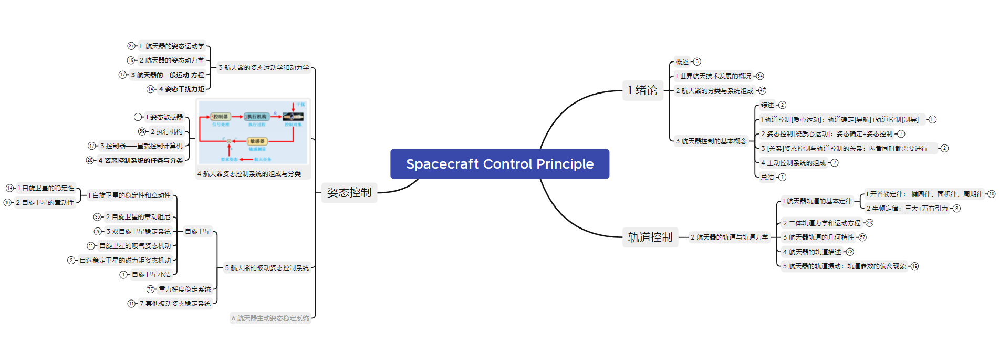

## 航天器控制原理

总体比较理论，工程性不强。

航天器控制原理是航天科学技术领域中的核心学科，它专注于航天器在轨道上的运动控制和姿态控制。具体来说，航天器控制涉及以下几个专业方面：

**控制系统组成**：航天器控制系统通常包括**姿态控制系统**和**轨道控制系统**。

1. **姿态动力学与控制**：包括**姿态确定和姿态控制**，研究航天器姿态运动的动力学模型，以及如何通过控制力矩实现姿态稳定和机动。
2. **轨道动力学与控制**：包括**轨道确定和轨道控制**，前者研究如何确定航天器的位置与速度，后者涉及改变航天器运动轨迹的技术，如轨道机动、轨道保持、轨道交会和再入返回控制。

另外，航天器控制还有更多方面需要讨论，可以在教材、前沿论文和工程等中看到。

资料：链接: https://pan.baidu.com/s/13kshLukgL_JzqJGwYTEgiw?pwd=wims 提取码: wims 
