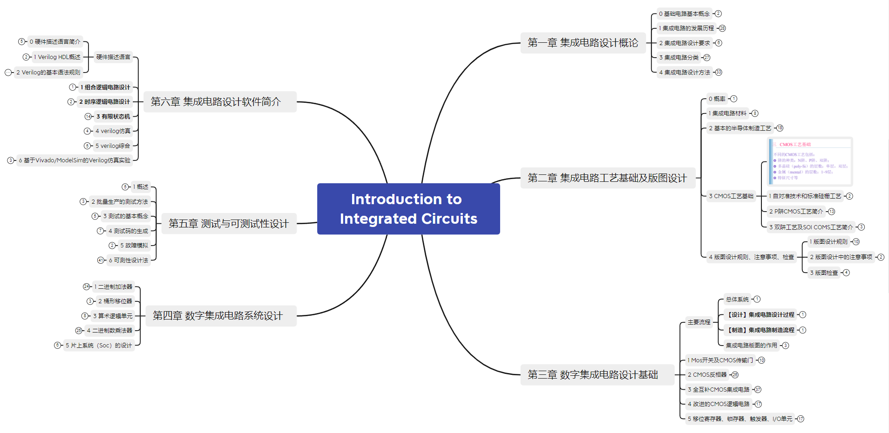

## 集成电路导论

我从朋友的地方找到的对应课程，主要是产生对集成电路行业的基本认识。值得注意的是，这些PPT上的内容还是比较理论，细化到垂直领域中还是需要根据行业需求进行深入学习。

xmind 链接: https://pan.baidu.com/s/1Dppp_rvW03ZPQ1ft4cglRA?pwd=4nun 提取码: 4nun 

我在里面放了微电子专业很重要的一本书 **模拟CMOS集成电路设计[国外名校最新教材精选] (拉扎维**) 供之后进一步学习。