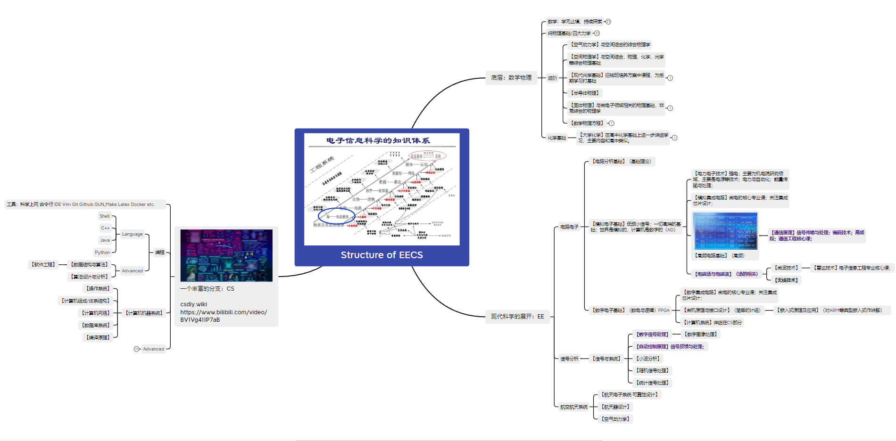

此文件用于说明大四学年及未上传的文件。

### 上传的一些内容

主要整理过去几年中学习零散的核心课周围的课程，包括之前钱班培养方案的简单自学内容和选修内容。

### 一个本科EECS知识图谱（简）

> 供简单参考，回顾EECS本科历史学习过程。

链接: https://pan.baidu.com/s/1IIwUgFqxCd2v5TwL-QoljQ?pwd=rdas 提取码: rdas 

### 未上传的文件

其他没上传的文件，要么是一些文化性的科目，要么是一些开卷考试的开放内容，而我没有更多的精力去提取核心，或者是一些不成体系的内容（之后会一起成体系的考虑放进来）。

未上传如下：

- 所有的政治、心理、体育课程
- 所有竞赛相关文件

### 大四学年

除了那段自我纠结和低沉的时光，大多数时间我也在不停学习很多很多东西，详细的不再透露。有机会，我可能会将这些项目和额外的学习放入github，这是后话了。

### 他山之石

更多的接触社会、田野调查，理解社会运行规律，可能会对本科学习的内容会有更深的理解和进一步探索的兴趣。